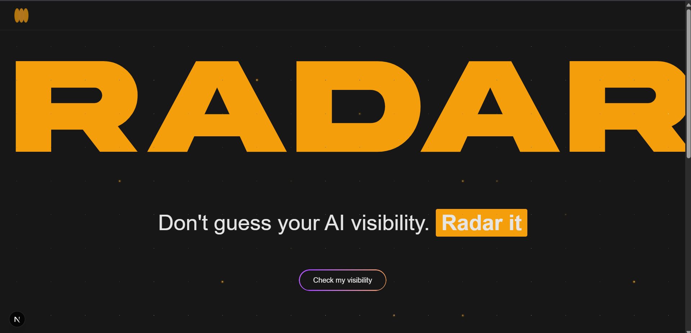
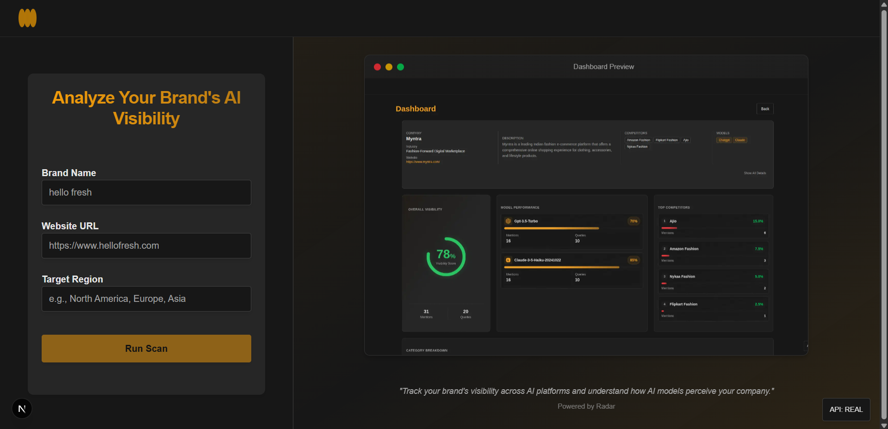
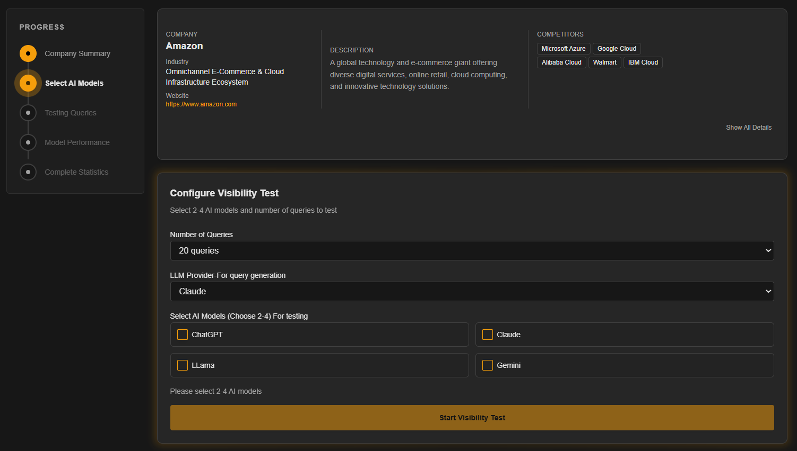
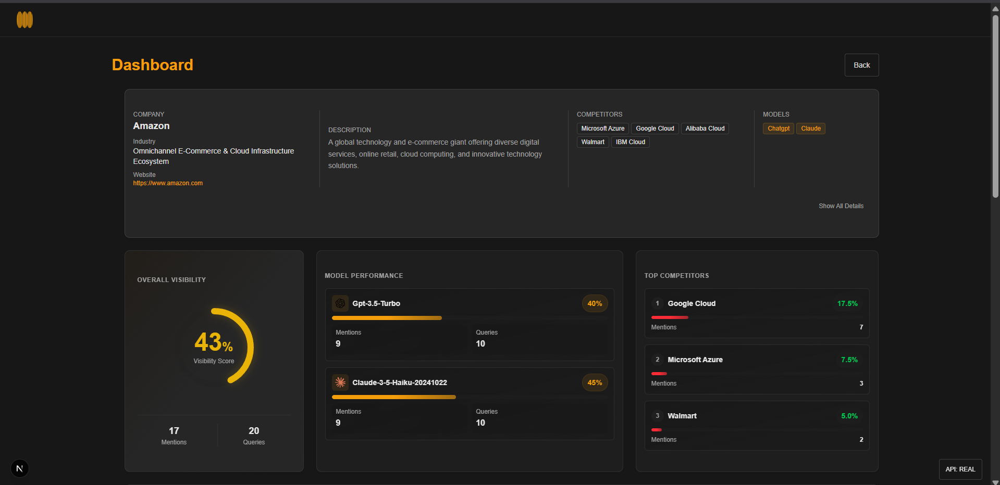

# RADAR - AI Visibility Tracking Platform

<div align="center">
  
  
  <p align="center">
    <strong>Don't guess your visibility. Radar it.</strong>
  </p>
  
  <p align="center">
    Track your brand's visibility across AI models and optimize your AI presence
  </p>
</div>

---

## 🎥 Demo Video

Watch RADAR in action and see how it helps track your brand's AI visibility:

**[📺 View Demo Video](https://drive.google.com/file/d/1Qrkt6YjbbT8foxMWcgv4qfr90PkLNDYf/view?usp=sharing)**

---

## 📋 Table of Contents

- [About](#about)
- [Features](#features)
- [Screenshots](#screenshots)
- [Prerequisites](#prerequisites)
- [Installation](#installation)
- [Running the Project](#running-the-project)
- [Project Structure](#project-structure)
- [Technologies Used](#technologies-used)

---

## 🎯 About

RADAR is a comprehensive AI visibility tracking platform that helps businesses understand how AI models perceive and mention their brand. Get insights into your AI presence, compare against competitors, and optimize your visibility across ChatGPT, Claude, Perplexity, and Gemini.

---

## ✨ Features

- **Industry Detection** - Automatically identifies relevant queries for your industry
- **Multi-Model Testing** - Compare visibility across ChatGPT, Claude, Perplexity, and Gemini
- **Competitor Analysis** - See how you rank against competitors in AI responses
- **Complete Query Transparency** - View every query tested with detailed results
- **Real-time Dashboard** - Monitor your AI visibility metrics in real-time
- **Responsive Design** - Fully optimized for desktop, tablet, and mobile devices

---

## 📸 Screenshots

<div align="center">
  
  <p><em>Comprehensive feature overview</em></p>
  
  
  <p><em>Analytics dashboard</em></p>
  
  
  <p><em>Query breakdown and analysis</em></p>
</div>

---

## 📦 Prerequisites

Before you begin, ensure you have the following installed:

- **Node.js** (v18.0.0 or higher)
- **npm** (v9.0.0 or higher) or **pnpm** (v8.0.0 or higher)

---

## 🚀 Installation

1. **Clone the repository**

```bash
git clone <repository-url>
cd radar-frontend
```

2. **Install dependencies**

Using npm:

```bash
npm install
```

Or using pnpm:

```bash
pnpm install
```

3. **Configure environment variables**

Copy the example environment file:

```bash
cp .env.example .env.local
```

Edit `.env.local` to configure your API settings:

```bash
# API Mode: 'mock' or 'real'
NEXT_PUBLIC_API_MODE=mock

# API Base URL (only used when API_MODE=real)
NEXT_PUBLIC_API_URL=http://localhost:8000
```

**Environment Variables:**

- `NEXT_PUBLIC_API_MODE`: Controls which API implementation to use
  - `mock` (default): Use simulated API responses for development without backend
  - `real`: Connect to actual backend API server
- `NEXT_PUBLIC_API_URL`: Base URL for the backend API (only used when `NEXT_PUBLIC_API_MODE=real`)
  - Development: `http://localhost:8000`
  - Production: Your production API URL

---

## 🏃 Running the Project

### Development Mode

Start the development server:

```bash
npm run dev
```

Or with pnpm:

```bash
pnpm dev
```

The application will be available at [http://localhost:3000](http://localhost:3000)

### API Modes

The application supports two API modes:

**Mock Mode (Default)**

- Uses simulated API responses
- No backend server required
- Perfect for frontend development and testing
- Realistic delays and data structures

**Real Mode**

- Connects to actual backend API
- Requires backend server to be running
- Use for integration testing and production

To switch modes:

1. Update `NEXT_PUBLIC_API_MODE` in your `.env.local` file
2. In development, use the API mode toggle in the bottom-right corner of the dashboard

### Production Build

1. **Build the project**

```bash
npm run build
```

2. **Start the production server**

```bash
npm start
```

### Linting

Run ESLint to check code quality:

```bash
npm run lint
```

---

## 📁 Project Structure

```
radar-frontend/
├── public/                    # Static assets
│   └── screenshorts/         # Application screenshots
├── src/
│   ├── app/                  # Next.js app directory
│   │   ├── dashboard/        # Dashboard page
│   │   ├── hero/            # Hero screen component
│   │   ├── globals.css      # Global styles
│   │   ├── layout.tsx       # Root layout
│   │   └── page.tsx         # Home page
│   ├── assets/              # Fonts and images
│   │   └── fonts/           # Custom fonts (Akira, Poppins)
│   ├── components/
│   │   ├── landing/         # Landing page components
│   │   │   ├── Hero.tsx     # Hero section
│   │   │   └── Features.tsx # Features section
│   │   ├── layout/          # Layout components
│   │   │   └── Header.tsx   # Header component
│   │   └── ui/              # Reusable UI components
│   └── lib/                 # Utility functions
├── components.json          # shadcn/ui configuration
├── next.config.ts          # Next.js configuration
├── package.json            # Dependencies
├── postcss.config.mjs      # PostCSS configuration
└── tsconfig.json           # TypeScript configuration
```

---

## 🛠️ Technologies Used

- **[Next.js 16](https://nextjs.org/)** - React framework with App Router
- **[React 19](https://react.dev/)** - UI library
- **[TypeScript](https://www.typescriptlang.org/)** - Type-safe JavaScript
- **[Tailwind CSS 4](https://tailwindcss.com/)** - Utility-first CSS framework
- **[shadcn/ui](https://ui.shadcn.com/)** - Re-usable component library
- **[Lucide React](https://lucide.dev/)** - Icon library
- **[Motion](https://motion.dev/)** - Animation library
- **Custom Fonts** - Akira (headings) & Poppins (body text)

---

## 🎨 Key Features Implementation

### Animated Hero Section

- Custom typing animation effect
- Smooth RADAR text reveal with slide-in animation
- Gradient highlight on key phrases
- Animated background beams

### Responsive Design

- Mobile-first approach
- Optimized layouts for all screen sizes
- Touch-friendly interactive elements

### Performance Optimizations

- React Compiler enabled
- Optimized font loading with `next/font`
- Image optimization with Next.js Image component
- CSS-in-JS with Tailwind CSS

---

## 📝 License

This project is private and proprietary.

---

## 🤝 Contributing

This is a private project. For any questions or issues, please contact the development team.

---

<div align="center">
  <p>Built with ❤️ using Next.js and React</p>
</div>
